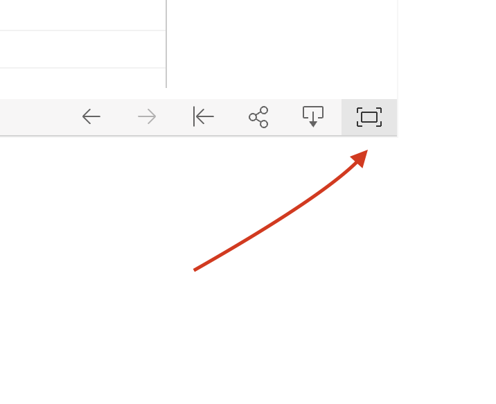

# citi-bike-tableau

# Jersey City vs New York City

Created by [Celeste Muniz - Lithgow](https://github.com/celeste1030)

## Table of Contents
* [About](#about)
* [How to View](#how-to-view)
* [Data Clean Up](#data-clean-up)
* [Observations](#observations)
* [Technologies](#technologies)

## About

A lot can change when you cross the Hudson.  

Here are some visuals and observations based on the latest Citibike data (December 2020) for Jersey City and New York City.

## How to View

1. Go to this [Tableau Public Link:](https://public.tableau.com/profile/celeste.m2243#!/vizhome/citibike_hw_16128210087790/CitiBikeDEC2020)
https://public.tableau.com/profile/celeste.m2243#!/vizhome/citibike_hw_16128210087790/CitiBikeDEC2020
2. Scroll down to the lower right hand side of the slide and click "Full Screen" mode.

3. Start with CitiBikeDEC2020 story and view my presentation.

## Data Clean Up

The [data provided by Citibike](https://www.citibikenyc.com/system-data) has information for each ride: trip duration in seconds, station id's, station names, bike id, start/ end times, birth year, gender, and membership level (usertype). Using jupyter notebook,  I made smaller csv files focused on specific attributes that would help me tell a visual story.

##### Csv files:

* [Jersey City End Stations](Data/jc_stations_end.csv)
* [Jersey City Start Stations](Data/jc_stations_start.csv)
* [Jersey City Usertype Count](Data/jc_subcount.csv)
* [Jersey City Trips](Data/jc_trips.csv)
* [Jersey City Age](Data/jc_user_age.csv)
* [New York City End Stations](Data/nyc_stations_end.csv)
* [New York City Start Stations](Data/nyc_stations_start.csv)
* [New York City Usertype Count](Data/nyc_subcount.csv)
* [New York City Trips](Data/nyc_trips.csv)
* [New York City Age](Data/nyc_user_age.csv)

## Observations

#### Total Users:

- Total number of rides is significantly higher in NYC with a total of 1,088,929 rides.  JC has a total number of 11,694 rides.

- In both JC and NYC, monthly subscribers make up the majority of users who took rides this month.

------------------------------------------------------------------------

#### Average Daily Trip by Gender and Usertype:

- In both NYC and JC, customers have a higher average trip duration than subscribers.  

- NYC riders have longer trip durations than JC riders.

- Women in both NYC and JC took longer rides than men and riders who did not disclose thier gender.

- Midweek is the most popular time to ride.

------------------------------------------------------------------------

#### Total Rides by Age:

- In both NYC and JC riders 50-59 make up the majority of the customers.

- In both NYC and JC riders 30-39 make up the majority of the subscribers.

- JC barely has any riders under 21.  Although NYC has more riders under 21, this is not a significant age range for NYC either.

- Most elderly riders are subscribers.

------------------------------------------------------------------------  

#### Jersey City: Start and End Stations

- JC has significantly less stations than NYC.

- Areas with stations are concentrated in neighborhoods with a higher median household income.  Neighborhoods with a low median household income have no stations.

- The popularity of these stations are also concentrated in areas with high median income.

- Some popular JC ending stations are actually located in NYC near popular commuter locations such as Port Authority and downtown piers.

------------------------------------------------------------------------

#### New York: Start and End Stations

- NYC has a distinctly higher amount of  stations than JC.

- Similar to  JC, areas in NYC with stations are concentrated in neighborhoods with a higher median household income.  Neighborhoods with a low median household income have no stations.

- A majority of the Bronx, Queens, Brooklyn and the entirety of Staten Island do not have stations. 

- The most popular starting and ending stations are also located in areas with higher income. 

## Technologies

- Tableau Public
- Jupyter Notebook
- Pandas
- Excel

